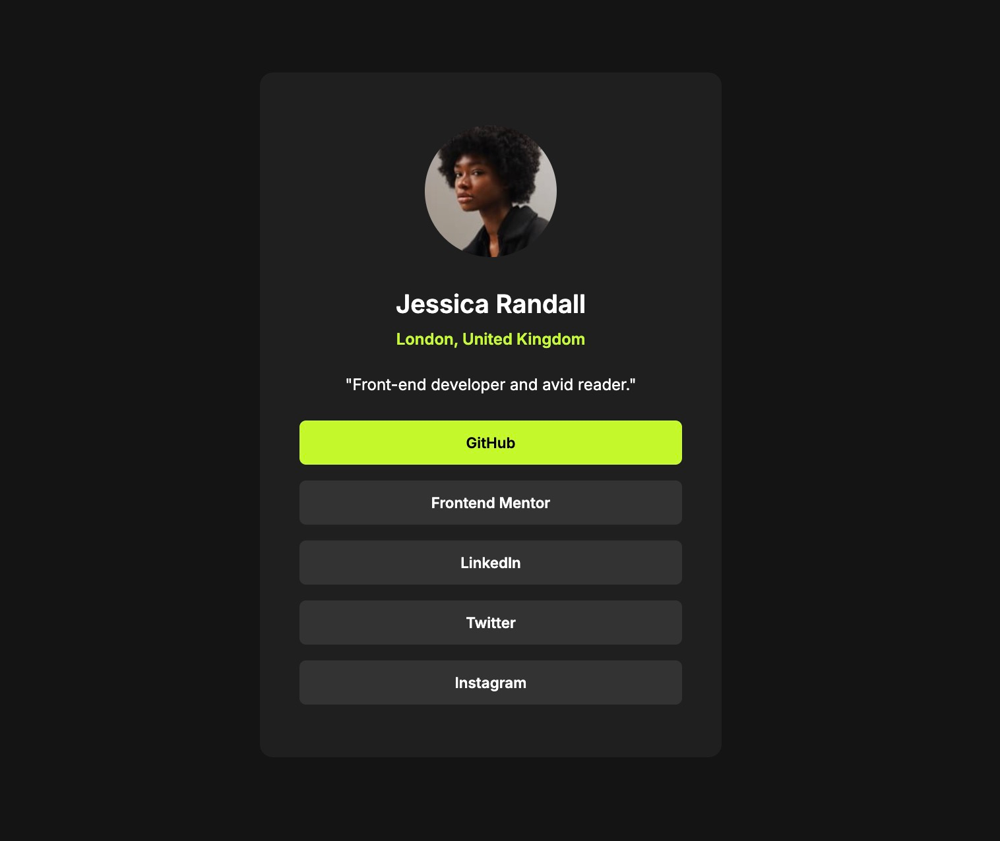

# 🔗 Social Links Profile – Frontend Mentor Challenge

A clean and responsive profile card that displays social media links. This project was built as part of a [Frontend Mentor](https://www.frontendmentor.io) challenge to practice modern HTML and CSS techniques.

## 📸 Preview



➡️ Live site: https://dzik0.github.io/social-links-profile/

## 🌟 Features

- Responsive design for mobile and desktop
- Clean layout with semantic HTML
- Styled using **Inter** font from Google Fonts
- Interactive social buttons (non-functional by default)

## 🧱 Built With

- HTML5
- CSS3
- Google Fonts: _Inter_

## 📁 Project Structure

```
├── index.html
├── main.css
├── assets/
│   └── images/
│       ├── avatar-jessica.jpeg
│       └── favicon-32x32.png
```

## 🚀 Getting Started

1. **Clone the repository:**

```bash
git clone https://github.com/YOUR-USERNAME/social-links-profile.git
```

2. **Navigate to the project directory:**

```bash
cd social-links-profile
```

3. **Open `index.html` in your browser to view the page.**

## 🧪 Customization Tips

- Replace **Jessica Randall's** details and photo with your own.
- Update button links to point to your actual social profiles.
- Modify styles in `main.css` to personalize the design.

## 🎯 Challenge Info

- Source: [Frontend Mentor – Social links profile](https://www.frontendmentor.io/challenges/social-links-profile-UG32l9m6dQ)

## 👤 Author

- Created by **Piotr Głazowski**

## 📄 License

This project is open-source and available under the [MIT License](LICENSE).

---
